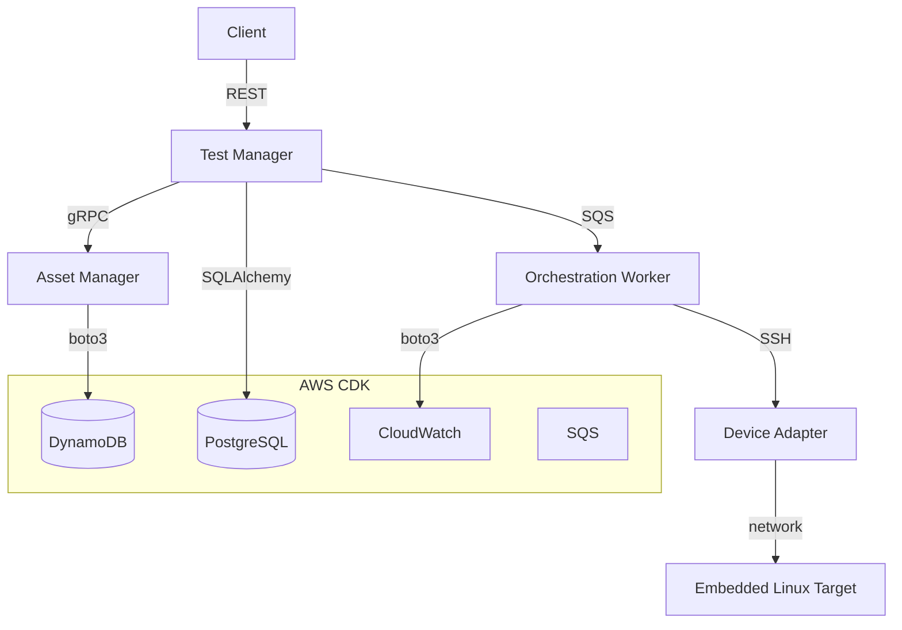

# testbed-orch

A distributed test orchestration and asset management platform for coordinating physical and virtual test infrastructure. Manages device reservations, orchestrates test execution, and stores results across PostgreSQL and DynamoDB. Services are defined via Protobuf IDLs, deployed to AWS using Amazon CDK, and communicate with embedded Linux targets over SSH through a generic device adapter interface.

---

## Architecture



| Component | Language | Storage | Transport |
|---|---|---|---|
| Asset Manager | Python | DynamoDB | gRPC / Protobuf |
| Test Manager | Python (FastAPI) | PostgreSQL | REST |
| Orchestration Worker | Python | SQS | internal |
| Device Adapter | Python | — | SSH (Paramiko) |
| Infrastructure | TypeScript | — | Amazon CDK |

---

## Local Setup

**Prerequisites:** Docker, Docker Compose, Python 3.11+, Node 18+, AWS CLI

```bash
# Clone and enter the repo
git clone https://github.com/LuVerissimo/testbed-orch
cd testbed-orch

# Copy environment config
cp .env.example .env

# Start all services (LocalStack, PostgreSQL, linux-target)
make dev

# Generate Protobuf stubs
make proto

# Run database migrations
make migrate
```

---

## Submitting a Test Job (end-to-end)

```bash
# 1. Submit a job targeting a registered device
curl -X POST http://localhost:8000/jobs \
  -H "Content-Type: application/json" \
  -d '{
    "device_id": "device-001",
    "command": "uname -a",
    "timeout_seconds": 30
  }'

# Response
# { "job_id": "abc123", "status": "QUEUED" }

# 2. Poll for result
curl http://localhost:8000/jobs/abc123

# Response
# { "job_id": "abc123", "status": "COMPLETED", "exit_code": 0, "stdout": "Linux ..." }
```

---

## Running Tests

```bash
# All tests
make test

# Unit tests only (no Docker required)
make test-unit

# Integration tests (requires make dev running)
make test-integration
```

---

## CI/CD

GitLab pipeline defined in `.gitlab-ci.yml`:

```
lint → test → build → deploy
```

- **lint** — ruff (Python), eslint (CDK TypeScript)
- **test** — full integration suite via docker-compose
- **build** — Docker images pushed to ECR, tagged with `$CI_COMMIT_SHA`
- **deploy** — `cdk deploy` gated to `main` branch, credentials via OIDC (no long-lived keys)

---

## Project Structure

```
testbed-orch/
├── asset-manager/        # gRPC service — device reservations (DynamoDB)
├── test-manager/         # REST API + worker — job orchestration (PostgreSQL)
├── device-adapter/       # DeviceAdapter interface + SSH implementation
├── proto/                # Protobuf IDL definitions
├── infra/                # Amazon CDK app (TypeScript)
├── docs/
│   ├── adr/              # Architecture Decision Records
│   └── runbook.md        # Operational runbook
├── docker-compose.yml
├── Makefile
└── .gitlab-ci.yml
```

---

## Docs

- [Architecture Decision Record](docs/adr/001-architecture.md)
- [Operational Runbook](docs/runbook.md)